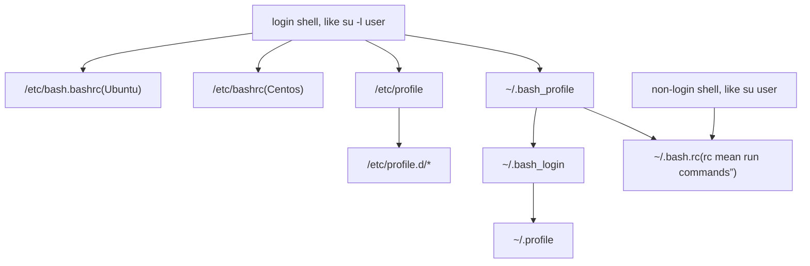

## Linux环境变量的依赖关系

- [Difference .bashrc vs .bash_profile (which one to use?)](https://www.golinuxcloud.com/bashrc-vs-bash-profile/)

- [login shell和non-login shell](https://blog.csdn.net/sfhawx/article/details/49969321)